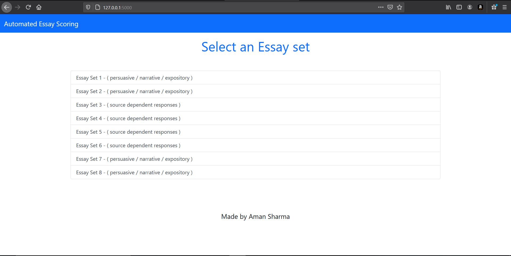

# Automated-Essay-Grading
This is a project based on Natural Language Processing.

In this project, a Deep Learning model predicts the score of a given input essay.
_________________________________________________________________________________________________________________________________________________________________________________________
### Dataset
The dataset is taken from The Hewlett Foundation: Automated Essay Scoring. It was uploaded on Kaggle.

The link of the dataset -> https://www.kaggle.com/c/asap-aes/data
_________________________________________________________________________________________________________________________________________________________________________________________
### Data Preprocessing
* Firstly, the paragraphs are turned into list of sentences.
* Then these sentences are turned into list of words.
* After this, we have trained a Word2Vec model on the training set. We have saved this model as word2vecmodel.bin
* This model is then used for generating Average Feature Vectors (X to train in deep learning model).
* The deep learning model is made using lstm. This model is saved as lstmmodel.h5
_________________________________________________________________________________________________________________________________________________________________________________________
### Performance
The accuracy is weighted by Quadrated Weighted Kappa(QWK) which measures the agreement between two users.The model architecture consists of 2 Long Short Term Memory(LSTM) layers with a Dense output layer. The final layer uses the Relu activation function.

QWK calculated is 0.95 or 95% on test dataset.
_________________________________________________________________________________________________________________________________________________________________________________________
### App
- The Frontend of the app is made using HTML, CSS and Bootstrap.
- The Frontend and Deep Learning model are integrated in the app using Flask and python.
- If you want to try the app, then clone this repo and run
```
python app.py
```
_________________________________________________________________________________________________________________________________________________________________________________________
Requirements are all listed in requirements.txt
________________________________________________________________________________________________________________________________________________________________________________________
### Working of app

